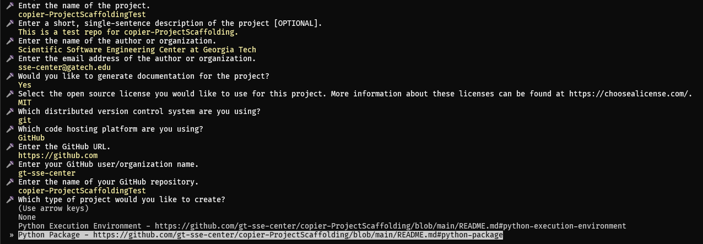

# copier-ProjectScaffolding

<!-- BEGIN: Exclude Package -->
<!-- [BEGIN] Badges -->

<!-- [END] Badges -->
<!-- END: Exclude Package -->

Copier (https://copier.readthedocs.io/.) template to create scaffolding for different project types (python packages, etc.).

<!-- BEGIN: Exclude Package -->
## Contents
- [Overview](#overview)
- [Installation](#installation)
- [Development](#development)
- [Additional Information](#additional-information)
- [License](#license)
<!-- END: Exclude Package -->

## Overview
copier-ProjectScaffolding is a [Copier](https://copier.readthedocs.io/) template used to setup the scaffolding associated with different project types. When using copier-ProjectScaffolding, you will be asked to create a project along a number of different dimensions:

- Generate Documentation: Yes, No
- Repository Tool: [git](https://git-scm.com/), None
- Hosting Platform: [GitHub](https://github.com), None
- Project Type: [Python Execution Environment](#python-execution-environment), [Python Package](#python-package)
- Continuous Integration / Delivery / Deployment: Yes, No
- Sign Artifacts: Yes, No
- Generate docker Images: Yes, No
- Additional Options based on project type (for more information, see [Project Types](#project-types))

Examples of generated output can be found at [gt-sse-center/copier-ProjectScaffolding-Sample-PythonExecutionEnvironment](https://github.com/gt-sse-center/copier-ProjectScaffolding-Sample-PythonExecutionEnvironment) and [gt-sse-center/copier-ProjectScaffolding-Sample-PythonPackage](https://github.com/gt-sse-center/copier-ProjectScaffolding-Sample-PythonPackage).

### Next Steps
- [Project Types](#project-types)
- [Installation](#installation)
- [Development](#development)

### Project Types
When running copier with the copier-ProjectScaffolding template, you are prompted to select a project type to generate. Information on all available project types can be found in the following sections.

- [Python Execution Environment](#python-execution-environment)
- [Python Package](#python-package)

#### Python Execution Environment
The Python Execution Environment package type creates an environment that contains a stand-alone version of python and installs all required dependencies during the bootstrap process. It produces a small number of files and is best suited for running python scripts. However, it does not contain the tooling required for modern python development (see [Python Package](#python-package) for a project type that does include this type of tooling).

##### Example Repository
- [gt-sse-center/copier-ProjectScaffolding-Sample-PythonExecutionEnvironment](https://github.com/gt-sse-center/copier-ProjectScaffolding-Sample-PythonExecutionEnvironment)

##### Functionality includes:
- Python bootstrapping via [PythonBootstrapper](https://github.com/davidbrownell/PythonBootstrapper)
- Automatic dependency installation via [requirements.txt](https://pip.pypa.io/en/stable/reference/requirements-file-format/)
- GitHub [Recommended Community Standards](https://opensource.guide/) documentation
- GitHub [pull request template](https://docs.github.com/en/communities/using-templates-to-encourage-useful-issues-and-pull-requests/creating-a-pull-request-template-for-your-repository)
- GitHub [issue templates](https://docs.github.com/en/communities/using-templates-to-encourage-useful-issues-and-pull-requests/configuring-issue-templates-for-your-repository)

#### Python Package
The Python Package project type creates an environment suitable for the development and publishing of [python](https://python.org) packages that adhere to modern best practices.

##### Example repository
- [gt-sse-center/copier-ProjectScaffolding-Sample-PythonPackage](https://github.com/gt-sse-center/copier-ProjectScaffolding-Sample-PythonPackage)

##### Functionality includes:
- Python bootstrapping via [PythonBootstrapper](https://github.com/davidbrownell/PythonBootstrapper)
- Source code formatting via [black](https://github.com/psf/black)
- Static source analysis via [pylint](https://github.com/pylint-dev/pylint)
- Automated test execution via [pytest](https://docs.pytest.org/)
- Code coverage extraction via [coverage](https://coverage.readthedocs.io/)
- Semantic version generation via [AutoGitSemVer](https://github.com/davidbrownell/AutoGitSemVer)
- Python [wheel](https://pythonwheels.com/) creation
- Wheel deployment to [PyPi](https://pypi.org/)
- Executable generation via [cx_Freeze](https://marcelotduarte.github.io/cx_Freeze/)
- Simple local development through `Build.py`
- Full [Continuous Integration](https://en.wikipedia.org/wiki/Continuous_integration), [Continuous Delivery](https://en.wikipedia.org/wiki/Continuous_delivery), and [Continuous Deployment](https://en.wikipedia.org/wiki/Continuous_deployment) (via [GitHub Actions](https://github.com/features/actions)) for everything listed above
- GitHub [Recommended Community Standards](https://opensource.guide/) documentation
- GitHub [pull request template](https://docs.github.com/en/communities/using-templates-to-encourage-useful-issues-and-pull-requests/creating-a-pull-request-template-for-your-repository)
- GitHub [issue templates](https://docs.github.com/en/communities/using-templates-to-encourage-useful-issues-and-pull-requests/configuring-issue-templates-for-your-repository)
- [Optional] Build artifact signing via [Minisign](https://jedisct1.github.io/minisign/)
- [Optional] Participation in the [Open Source Security Foundation (OpenSSF) Best Practices Badge Program](https://www.bestpractices.dev/)
- [Optional] Generation of development environment [docker](https://www.docker.com/) [images](https://aws.amazon.com/compare/the-difference-between-docker-images-and-containers/) in support of [FAIR principles](https://www.go-fair.org/fair-principles/)

### How to use copier-ProjectScaffolding
There are different techniques to run copier with this template, where each of these techniques result in the same generated output. Your choice of a specific technique depends solely on your comfort and familiarity with the tools employed in the technique itself.

- [Running with Docker](#running-with-docker)
- [Running with Python](#running-with-python)
- [Running from Source](#running-from-source)

#### Running with Docker
Running with [docker](https://www.docker.com) is a good choice if you are familiar with docker, as no other dependencies are required. Information on installing docker is available at https://docs.docker.com/engine/install/.

| Scenario | Command Line |
| --- | --- |
| Copy | `docker run -it --rm -v .:/output gtssecenter/copier-projectscaffolding copy /output --trust` |
| Recopy | `docker run -it --rm -v .:/output gtssecenter/copier-projectscaffolding recopy /output --trust` |
| Update | `docker run -it --rm -v .:/output gtssecenter/copier-projectscaffolding update /output --trust` |

#### Running with Python
copier-ProjectScaffolding requires additional python packages, which must be installed before invoking copier directly. Run the following command (ideally in a [python virtual environment](https://docs.python.org/3/library/venv.html) to avoid dependency conflicts) before invoking copier.

1. `pip install copier copier-templates-extensions dbrownell_Common`

*Specific package versions used by the docker image above can be found in the [Dockerfile](https://github.com/gt-sse-center/copier-ProjectScaffolding/blob/main/Docker/Dockerfile) used to build it.*

| Scenario | Command Line |
| --- | --- |
| Copy | `copier copy https://github.com/gt-sse-center/copier-ProjectScaffolding /output --trust` |
| Recopy | `copier recopy /output --trust` |
| Update | `copier update /output --trust` |

#### Running from Source
You can run copier directly on the copier-ProjectScaffolding source, if you plan on making changes to the template. See [DEVELOPMENT.md](https://github.com/gt-sse-center/copier-ProjectScaffolding/blob/main/DEVELOPMENT.md) for more information on each of these steps.

1. `git clone https://github.com/gt-sse-center/copier-ProjectScaffolding`
2. `Bootstrap.sh` or `Bootstrap.cmd`
3. `. ./Activate.sh` or `Activate.cmd`

| Scenario | Command Line |
| --- | --- |
| Copy | `copier copy . /output --trust --vcs-ref=HEAD` |
| Recopy | `copier recopy /output --trust --vcs-ref=HEAD` |
| Update | `copier update /output --trust --vcs-ref=HEAD` |

<!-- BEGIN: Exclude Package -->
## Installation
<!-- [BEGIN] Installation -->
No additional setup is required to use this project.
<!-- [END] Installation -->

## Development
<!-- [BEGIN] Development -->
Please visit [Contributing](https://github.com/gt-sse-center/copier-ProjectScaffolding/blob/main/CONTRIBUTING.md) and [Development](https://github.com/gt-sse-center/copier-ProjectScaffolding/blob/main/DEVELOPMENT.md) for information on contributing to this project.<!-- [END] Development -->
<!-- END: Exclude Package -->

## Additional Information
Additional information can be found at these locations.

| Title | Document | Description |
| --- | --- | --- |
<!-- [BEGIN] Additional Information -->
| Code of Conduct | [CODE_OF_CONDUCT.md](https://github.com/gt-sse-center/copier-ProjectScaffolding/blob/main/CODE_OF_CONDUCT.md) | Information about the the norms, rules, and responsibilities we adhere to when participating in this open source community. |
| Contributing | [CONTRIBUTING.md](https://github.com/gt-sse-center/copier-ProjectScaffolding/blob/main/CONTRIBUTING.md) | Information about contributing code changes to this project. |
| Development | [DEVELOPMENT.md](https://github.com/gt-sse-center/copier-ProjectScaffolding/blob/main/DEVELOPMENT.md) | Information about development activities involved in making changes to this project. |
| Governance | [GOVERNANCE.md](https://github.com/gt-sse-center/copier-ProjectScaffolding/blob/main/GOVERNANCE.md) | Information about how this project is governed. |
| Maintainers | [MAINTAINERS.md](https://github.com/gt-sse-center/copier-ProjectScaffolding/blob/main/MAINTAINERS.md) | Information about individuals who maintain this project. |
| Security | [SECURITY.md](https://github.com/gt-sse-center/copier-ProjectScaffolding/blob/main/SECURITY.md) | Information about how to privately report security issues associated with this project. |
<!-- [END] Additional Information -->

## License

copier-ProjectScaffolding is licensed under the <a href="https://choosealicense.com/licenses/mit/" target="_blank">MIT</a> license.
